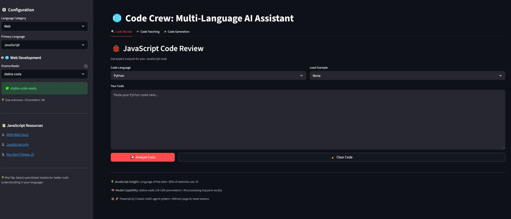
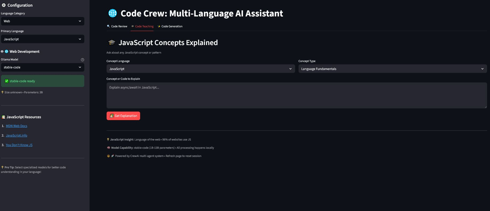
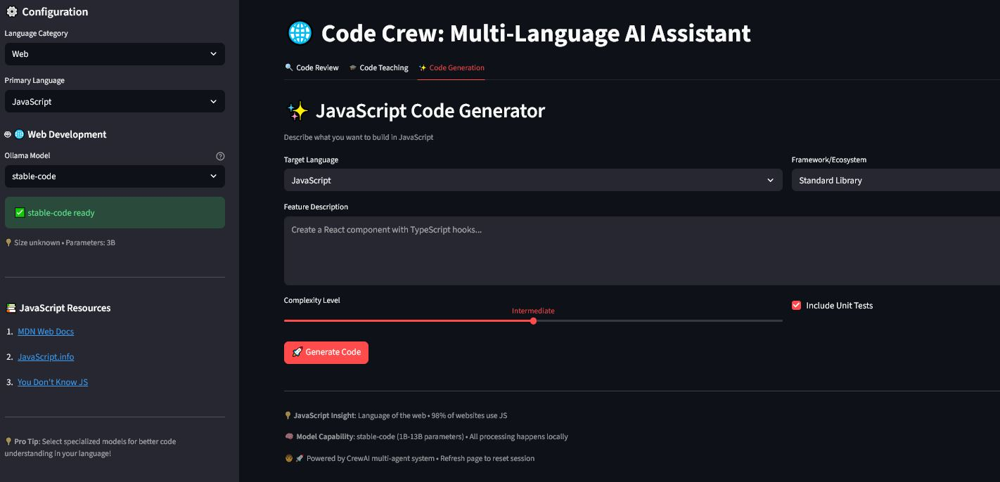

# Code Crew: Multi-Language AI Assistant

[](https://share.streamlit.io/yourusername/code-crew)

A powerful Streamlit application that leverages CrewAI's multi-agent framework with Ollama language models to provide intelligent code assistance across 11 programming languages. This tool combines language-specific expertise with local AI processing for secure, offline-capable development support.


## ✨ Features

### 🔍 Code Review Tab

- Line-by-line bug detection with language-specific anti-patterns
- Security vulnerability scanning (memory safety, injection risks)
- Automated refactoring suggestions following language style guides
- Specialized analysis for concurrency, memory leaks, and performance

### 🎓 Code Teaching Tab

- Concept explanations with language-specific context
- Practical examples with annotated code snippets
- Common pitfalls and best practices
- Official documentation references

### ✨ Code Generation Tab

- Production-ready code generation with error handling
- Built-in architecture review by specialized agents
- Unit test generation with framework-appropriate testing libraries
- Documentation and comments following language conventions

## ⚙️ Installation & Setup

### Prerequisites
1. **Ollama** installed and running ([Download Ollama](https://ollama.com/))
2. **Python 3.10+**
2. pip install -r requirements.txt in own environment

### Required Ollama Models
The application works best with specialized coding models. Install recommended models:
```bash
# Python-focused models
ollama pull codellama:python
ollama pull deepseek-coder:6.7b

# General purpose models
ollama pull codellama:70b-instruct
ollama pull mistral:7b-instruct
ollama pull llama3:70b-instruct
```

> 💡 **Tip**: The app will show installation instructions for missing models in the sidebar

## 🚀 Usage

1. **Select your programming language** from the categorized dropdown in the sidebar
2. **Choose a specialized Ollama model** (language-optimized recommendations appear automatically)
3. **Navigate between workflows** using the top tabs:
   - **Code Review**: Paste code for expert analysis and refactoring
   - **Code Teaching**: Ask about language concepts or patterns
   - **Code Generation**: Describe features to generate production-ready code
4. **Use sample templates** for common scenarios (memory leaks, concurrency bugs, etc.)
5. **Copy results** with one-click buttons after processing

## 🧠 How It Works

The application uses a multi-agent system powered by CrewAI:
1. **Language-Specialized Agents**: Each programming language has dedicated agents with backstories reflecting real-world expertise (e.g., "Rust core team member", "Go concurrency expert")
2. **Sequential Processing**:
   - Code Generation: Architect creates → Bug Hunter reviews
   - Code Review: Bug Hunter analyzes → Code Gardener refactors
   - Teaching: Dedicated educator explains concepts
3. **Context-Aware Prompts**: Language-specific best practices, style guides (PEP-8, Effective Go, etc.), and ecosystem considerations are injected dynamically
4. **Local Model Optimization**: Leverages Ollama's efficient inference with tuned parameters (`temperature=0.2`, `top_p=0.9`)

## 🛠 Configuration

### Environment Variables
| Variable | Default | Description |
|----------|---------|-------------|
| `OLLAMA_HOST` | `http://localhost:11434` | Ollama server URL |

### Customization Points
1. **Add new languages** by extending the `ProgrammingLanguage` enum
2. **Modify agent specializations** in the `create_language_specialist()` function
3. **Adjust model recommendations** by updating the `LANG_MODEL_CATEGORIES` dictionary
4. **Add sample code templates** to the `sample_codes` dictionary

## 🌐 Supported Language Ecosystems

| Language | Specialized Agents | Key Focus Areas | Recommended Models |
|----------|-------------------|-----------------|---------------------|
| **Python** | Principal Engineer | PEP-8, type hints, async | `codellama:python`, `deepseek-coder:6.7b` |
| **Go** | Google Staff Engineer | Concurrency, GC optimization | `starcoder2:15b`, `codellama:70b-instruct` |
| **Rust** | Core Team Member | Ownership, lifetimes, safety | `wizardcoder:15b`, `deepseek-coder:6.7b` |
| **JavaScript/TS** | TC39 Committee | ES2022+, type systems | `phi3:3.8b`, `mistral:7b-instruct` |
| **C/C++** | Kernel Maintainer | Memory safety, undefined behavior | `phind-codellama:34b`, `starcoder2:15b` |
| **Java/Kotlin** | Java Champion | Concurrency, JVM performance | `codellama:70b-instruct`, `wizardcoder:15b` |
| **C#** | .NET Architect | Async patterns, memory efficiency | `magicoder:7b`, `phi3:3.8b` |
| **Swift** | Apple Engineer | Value semantics, concurrency | `phi3:3.8b`, `codellama:70b-instruct` |


---

> **Note**: All AI processing happens locally on your machine. Your code never leaves your system.  
> **Hardware Recommendation**: For best performance with 70B parameter models, use a system with 32GB+ RAM and NVIDIA GPU with 24GB+ VRAM. Smaller models (7B-13B) work well on consumer hardware.